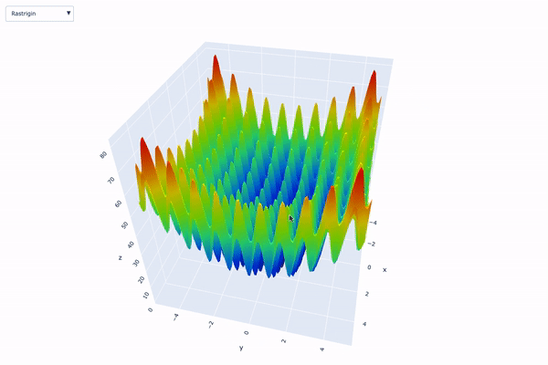

In this project, the following benchmark functions have been implemented to test single objective optimization algorithms:

- Rastrigin
- Ackley
- Sphere
- Rosenbrock
- Beale
- Goldstein-Price
- Booth
- Bukin function N.6
- Matyas
- Levi function N.13
- Himmelblau
- Three-hump camel
- Easom
- Cross-in-tray
- Eggholder
- Holder table
- McCormick
- Schaffer function N.2
- Schaffer function N.4
- Styblinski-Tang

Using Plotly, I have built a simple application that allows to visualize each of
them with a selection menu. Just run the main.py script and it will open the window 
with the Plotly visualizations. 

Below you can see the application in action.

